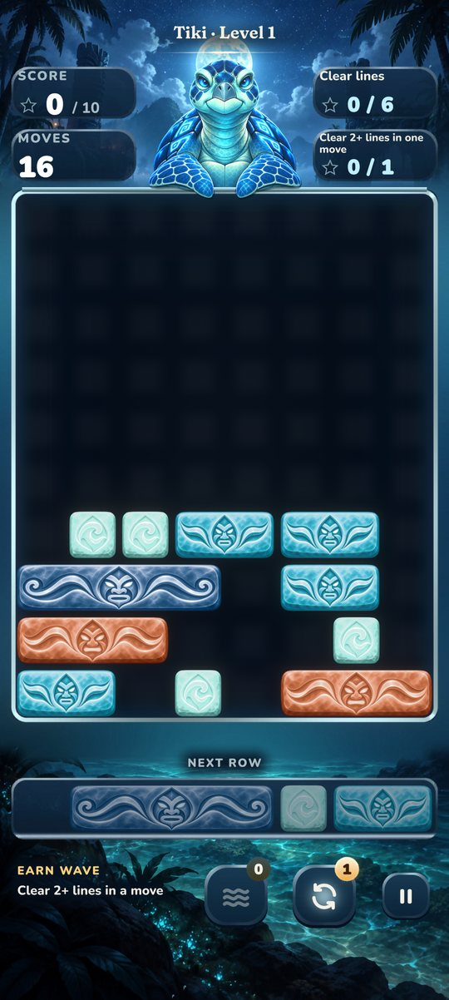

# zKube

zKube is a falling-block puzzle game where clearing lines feeds combos. One Rust engine and one Unity client
ship it as two Android games: walletless **zKube: Realms**, and **zKube: Arena** with a paid Daily on Solana.

  

## Products

| Game | Package | Store | Identity | What's in it |
| --- | --- | --- | --- | --- |
| zKube: Realms | com.zkorp.zkube.store | Google Play | Walletless; the name starts as Player and is edited in Profile | 100-level Campaign with a purchase policy on realms 4–10, and a local UTC Daily. ARM64 and x86_64 AAB without money assemblies or wallet plugins |
| zKube: Arena | com.zkorp.zkube | Solana dApp Store, Seeker | The connected Solana address, through the Kotlin Mobile Wallet Adapter plugin | Free Campaign whose stars are saved on chain, and the paid Arcade Daily. ARM64 APK |

Both share the Campaign, the Unity pages and board, and the Lumen skin. The original Starknet release, zKube:
Origins, spent several months among that network's most-used contracts.

**Status:** there is no live deployment. The former Devnet release was abandoned and the source is being prepared
for a fresh bootstrap. Store billing and distribution are in development, and mainnet waits on counsel, economic
and distribution review.

## How Arcade works

- **Kredits:** the owner prepays entries at 0.01 SOL each, in packs of 1, 10 or 25. Kredits are one-way: no
  withdrawal, transfer, cash-out or bonus. An authorized device spends them within the owner's cap.
- **Money:** 10% goes to the team at purchase. Spending a Kredit sends the other 90% to the following paid Daily,
  so an entry never grows the pot it competes for. Every entry is scored or expires; there are no refunds.
- **The Daily:** one realm and one objective, drawn from a deterministic cycle. Entries close at 23:59 UTC; a run
  with an accepted action scores its last committed state.
- **Two boards:** Score ranks action points and the Objective board (Theme in the protocol) ranks the drawn
  objective's count; they split the pot equally. With no Objective qualifier, its half folds into Score. Each
  player keeps their best run per board.
- **Prizes:** weights follow 1/rank and pay at least four places when enough players qualify. Winners claim
  by position for thirty days from the board's sealing; unclaimed prizes return to the next pot.
- **Ladder:** integer log-rank points for placing and a flat credit for qualifying. They pay no SOL and never
  decay.
- **Execution:** runs play on a MagicBlock ephemeral rollup with VRF and settle on Solana. Replay commitments let
  anyone recompute a result. A keeper handles cadence and recovery under separately approved limits.

Campaign plays locally in both games and never touches money. On Arena, the packed star array on chain is the
player's save, synchronized across their devices; stars grant no SOL, entries or prize eligibility.

## Repository

Read [AGENTS.md](AGENTS.md) before changing source, keeper behaviour or anything that moves SOL. It owns the
working rules, the development environment, the locked protocol rules and operator procedures.

| Folder | Owner | What it holds |
| --- | --- | --- |
| crates/zkube-core | Rust | The one engine: gameplay, metrics, clocks, payouts and replay |
| crates/zkube-core-host | Rust | Safe native codecs and the keeper's WASM exports |
| crates/zkube-core-ffi | Rust | The native byte boundary for Unity |
| crates/zkube-codegen | Rust | Catalog and skin validation, and every generated file |
| programs/solana | Anchor | Player records, Arcade lifecycle, accounting and settlement |
| services | TypeScript | The keeper, with no inbound HTTP surface |
| tools/chain, shared | TypeScript | Operator CLI, the checked-in program IDL and shared chain identity |
| unity | Unity | Both Android identities; toolchain.json pins the editor and identities, tools/build.py runs Unity |
| unity/Assets/ZKube | C# | Runtime (pages, board, kit, talk scene), Integration (Arena chain and wallet), Local (Realms saves and billing), Rendering, Android, Editor, Tests |
| unity/dapp-store | JSON | Solana dApp Store publishing metadata |
| assets | Art | Catalog, skins, guardians, shared images and sounds, and each product's brand |
| fixtures | Rust | Core golden vectors and Rust-produced boundary scenarios |

Generated files are never edited by hand; the codegen writes them.

## Commands

Prefix Solana, Anchor and chain commands with `NO_DNA=1`. Toolchain versions live in rust-toolchain.toml and
unity/toolchain.json.

| Task | Command |
| --- | --- |
| Install and build TypeScript | `pnpm install`, then `pnpm build` |
| Build the program | `NO_DNA=1 anchor build` |
| Regenerate generated files | `NO_DNA=1 cargo run -p zkube-codegen -- generate` |
| Regenerate fixtures | `python3 unity/tools/build.py fixtures --fixture-action generate` |
| Realms AAB and universal APK | `python3 unity/tools/build.py android --identity store` |
| Arena APK | `python3 unity/tools/build.py android --identity money` |
| Chain operator plans | `NO_DNA=1 pnpm chain --help`; AGENTS.md owns the procedures |

## Tests

| What | Command |
| --- | --- |
| Rust engine, codegen and program (SBF tests need the built program) | `cargo test` |
| Rust lints | `cargo clippy --workspace --all-targets` |
| Generated files have not drifted | `NO_DNA=1 cargo run -p zkube-codegen -- check` |
| Keeper, chain CLI and documentation (after `pnpm build` in a fresh worktree) | `pnpm test` |
| TypeScript lints and types | `pnpm lint`, `pnpm typecheck` |
| Unity EditMode and PlayMode | `python3 unity/tools/build.py test --test-platform all` (or one platform, with `--test-filter`) |
| Rust-produced fixtures are current | `python3 unity/tools/build.py fixtures` |
| The build tool | `cd unity/tools && python3 -m unittest discover -s tests -p 'test_*.py'` |

Android builds are inspected after they finish. build.py holds a lease, so two runs never share an Editor.

## Skins and art

- A skin is a folder under assets/skins/<id>/, listed in assets/catalog.json. Lumen is the only skin.
- Its slots are declared once, in crates/zkube-codegen/src/skins.rs: UI kit pieces (slice borders in skin.json),
  goal pictograms, ladder borders and badges, and per realm a background, HUD background and map painting (JPEG)
  plus a ledge, mote and four block sprites (PNG with alpha).
- Each realm's tokens.json holds its block tints and light colours; skin.json places its key light, shafts and
  motes.
- Guardians live in assets/theme-N/boss: ten full frames, a paws layer drawn over the board rim, and
  contact.json with the rail line they lean on.
- The codegen rejects a missing, extra or wrongly typed file; the Unity tests render the kit to catch seams and
  stray highlights.
- To change art, replace the file in assets/, then run the codegen and the Unity tests. build.py imports it
  into the atlases.

## Content

- Goal and Daily objective captions come from crates/zkube-codegen/src/captions.rs, and each goal's pictogram,
  value chip and counter from pictograms.rs beside it.
- Realm names, guardian titles and their ten lines come from assets/catalog.json.
- Page copy lives in the page that shows it.
- A retired model's words are listed in services/tests/supersession.test.ts so they cannot return.

## Devices

- The Realms store build includes x86_64 and runs on the Android emulator.
- The Arena money APK is ARM64 only and needs a physical device, such as the Seeker. Seed Vault Wallet is the
  reference wallet, with Phantom and Solflare on Android as further targets.
- Production candidates need an explicit version code and the owner's release signing; see AGENTS.md.

## License

Licensed under the Apache License, Version 2.0 — see [LICENSE](LICENSE).
Unless explicitly stated otherwise, contributions submitted for inclusion are
licensed on the same terms, without additional conditions.
